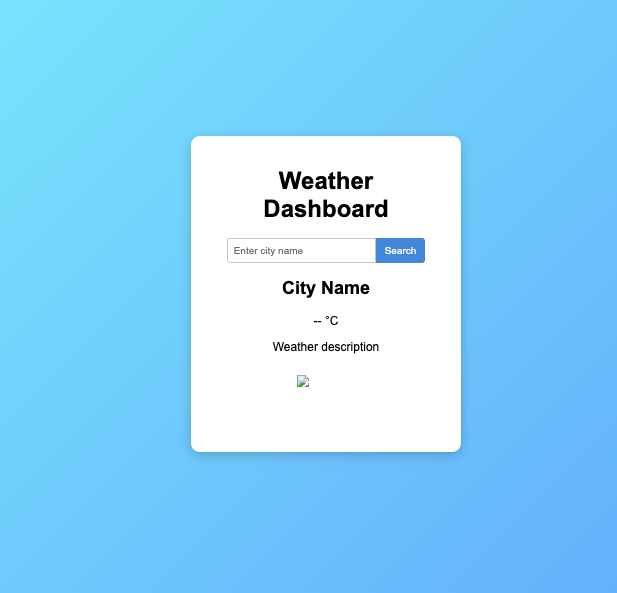

# Weather Dashboard

A simple web application that fetches real-time weather data for any city using the OpenWeatherMap API.

## Features
- Search for any city and get live weather information.
- Displays temperature, description, and weather icon.
- Responsive and clean design.

## Tech Stack
- HTML
- CSS
- JavaScript (Fetch API)
- OpenWeatherMap API

